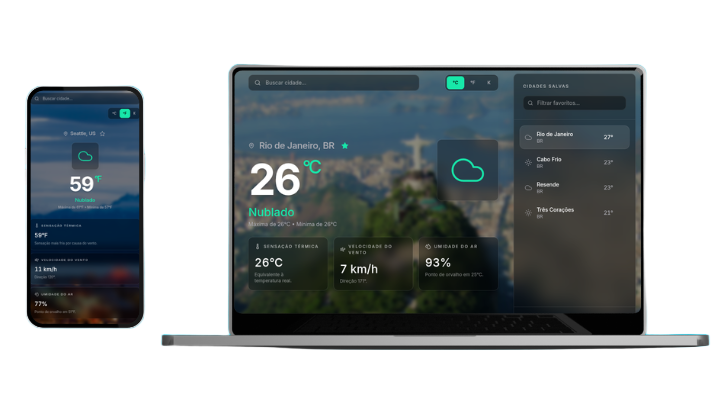

<h1 align="center" style="font-weight: bold;">
  <br />
</h1>

<p align="center">
  
  
  
</p>

<p align="center">
 <a href="#layout">Layout</a> •
 <a href="#features">Features</a> •
 <a href="#technologies">Technologies</a> •
 <a href="#colors">Colors</a> •
 <a href="#started">Getting Started</a> •
 <a href="#usage">Usage</a> •
 <a href="#routes">Routes</a> •
 <a href="#roadmap">Roadmap</a> •
 <a href="#colab">Collaborators</a> •
 <a href="#license">License</a>
</p>

<p align="center">
    <b>Aurora is a weather dashboard that shows current conditions for cities worldwide, powered by the OpenWeatherMap API.</b>
</p>

<p align="center">
    Search any city, save favorites, switch between Celsius, Fahrenheit, and Kelvin, and explore live metrics with a glassmorphism UI and dynamic city backgrounds from Wikipedia.
</p>

<p align="center">
     <a href="https://weatherviewer.vercel.app/">📱 Visit this Project</a>
</p>

<h2 id="layout">🎨 Layout</h2>

<p align="center">
    
</p>

<h2 id="features">✨ Features</h2>

- Search cities worldwide with real-time weather data
- Saved cities sidebar with filter and scrollable list
- Add and remove favorites with a single click
- Rio de Janeiro as the default starting city for new users
- Temperature display in Celsius, Fahrenheit, or Kelvin
- Feels-like, wind speed, and humidity metric cards
- Dynamic blurred background images sourced from Wikipedia
- Glass-style toast when a city is not found
- Layout animations powered by Framer Motion
- Responsive layout with a desktop favorites panel

<h2 id="technologies">💻 Technologies</h2>

**Client**

- [JavaScript](https://developer.mozilla.org/en-US/docs/Web/JavaScript)
- [React](https://reactjs.org/)
- [Next.js](https://nextjs.org/)
- [Tailwind CSS](https://tailwindcss.com/)
- [Framer Motion](https://www.framer.com/motion/)
- [Axios](https://axios-http.com/)
- [Lucide React](https://lucide.dev/)

**APIs**

- [OpenWeatherMap](https://openweathermap.org/) — current weather data
- [Wikipedia REST API](https://www.mediawiki.org/wiki/API:REST_API) — city background images

<h2 id="colors">🎨 Color Palette</h2>

| Color | Preview | Hex |
| ----- | ------- | --- |
| Background |  | `#000000` |
| Foreground |  | `#FFFFFF` |
| Surface |  | `#121316` |
| Primary |  | `#17D995` |
| Muted |  | `#27272A` |
| Muted Foreground |  | `#AFB0B5` |

<h2 id="started">🚀 Getting started</h2>

<h3>Cloning</h3>

```bash
git clone https://github.com/MarlonVictor/weatherViewer.git
cd weatherViewer
```

<h3>Installation</h3>

```bash
npm install
```

<h3>Starting</h3>

```bash
npm run dev
```

Open [http://localhost:3000](http://localhost:3000) in your browser.

<h3>Production build</h3>

```bash
npm run build
npm start
```

<h3>Deployment</h3>

The project is deployed at [https://weatherviewer.vercel.app/](https://weatherviewer.vercel.app/).

The production build is generated by Next.js and can be hosted on Vercel, Netlify, or any Node.js-compatible platform.

<h2 id="usage">👀 Usage</h2>

1. Open the app — Rio de Janeiro loads as the default city.
2. Use the search bar to look up any city by name.
3. Click the star icon to add or remove the current city from your saved list.
4. Use the sidebar to filter, browse, and switch between saved cities.
5. Toggle between `°C`, `°F`, and `K` in the top-right corner.

If a city is not found, a glass-style message appears below the search input and dismisses automatically after a few seconds.

Saved cities are stored in the browser via `localStorage` under the key `aurora.favorites.v1`.

<div id="routes"></div>

## 📍 Application Routes

| Route | Description |
| ----- | ----------- |
| <kbd>/</kbd> | Weather dashboard with search, saved cities, and live metrics |

<h2 id="roadmap">🧭 Roadmap</h2>

* [x] Aurora dashboard redesign with glassmorphism UI
* [x] Saved cities sidebar with scroll and filter
* [x] City search with auto-dismissing error feedback
* [x] Celsius, Fahrenheit, and Kelvin temperature toggle
* [x] Dynamic Wikipedia background images

<h2 id="colab">🤝 Collaborators</h2>

<table>
  <tr>
    <td align="center">
      <a href="https://github.com/MarlonVictor">
        <br>
        <sub>
          <b>Marlon Victor</b>
        </sub>
      </a>
    </td>
  </tr>
</table>

<h2 id="contribute">🤝 Contribute</h2>

Contributions are always welcome!

1. Fork the project
2. Create your feature branch (`git checkout -b feature/amazing-feature`)
3. Commit your changes (`git commit -m 'Add amazing feature'`)
4. Push to the branch (`git push origin feature/amazing-feature`)
5. Open a Pull Request

<h2 id="license">License 📃</h2>

This project is under [MIT](./LICENSE) license.
